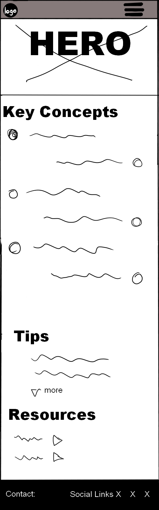
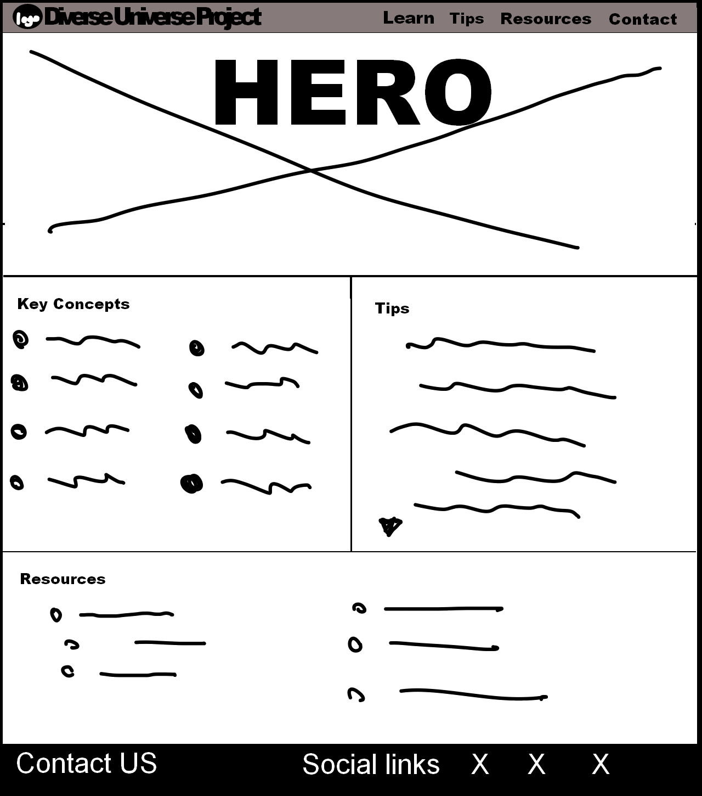

# Diverse Universe Project | Joanne Wright

## Code Institute - Portfolio Project 1

### HTML/CSS/Bootstrap Individual Project

[Click Here to view the Live Project.](https://jo-jpeg.github.io/flagstone-project-01/)

[Click here to view the Repository.](https://github.com/Jo-JPEG/flagstone-project-01)

## Contents
 * [The Why](#the-why)
 * [User Stories](#user-stories)
 * [Design](#design-brief)
 * [Wireframes](#wireframes)
 * [Colours](#colours)
 * [Fonts](#fonts)
 * [Logo](#logo)
 * [Technologies](#technologies)
 * [Testing](#testing)
 * [Known bugs](#known-bugs)
 * [Future Scope](#future-scope)
 * [Credits](#credits)

### The Why
This proposed website aims to provide an overview of concepts important to promoting diversity and inclusion in education and workplaces. The platform will help users easily gain an overview of the Key concepts of diversity, read tips on practical implimentation and easily find external resources to learn further information. The website's primary goal is to provide a comprehensive overview of the topic and help users find reliable information.

### User Stories

#### User Story 1:
As a new visitor to the website, I want to easily find an introduction to diversity and inclusion, so I can understand the basics and its importance in the workplace or educational environment.
User friendly navigation and responsive design (must-have)
Acceptance Criteria
- The website is fully responsive across various devices and screen sizes.
- Site layout and navigation are intuitive, allowing easy access to different sections.
Tasks
- Apply responsive design principles using Bootstrap to ensure the website is accessible on various devices.
- Arrange the site layout and navigation based on best practices, ensuring all key sections and pages are easily accessible.

#### User Story 2:
As an employee or student, I want to access practical tips for fostering an inclusive environment, along with external links to other organisations so I can learn more about different aspects of diversity.

Easy to find sections and well-organised information (must-have)

Acceptance Criteria
- The website contains a section of tips for fostering an inclusive environment 
- The website contains a resources section with external links.
- The sections are linked in the navbar and contain buttons to expand sections depending on the reader’s interest. 
Tasks
- Create tips section with collapsible section allowing user to click button to read more
- Create a resources section with links to outside websites. Correctly links with aria labels

#### User Story 3: 
As a user with a visual impairment, I want to be able to navigate the site using a screen reader. 
Accessible content with easy to read text and correct use of semantic elements (must-have)

Acceptance Criteria
- The website uses best practices in regard to accessibility 
- The site can be navigated by screen readers and the text is readable and high-contrast
Tasks
- Ensure all images are correctly described using alt-text
- Make HTML code as semantic as possible
- Check code with external resources such as Lighthouse

#### User Story 4:
As a mobile user looking for quick information, I want to see all website content easily on a small screen, so I can get answers to common questions easily.
Responsive, mobile-first design. (must-have)

Acceptance Criteria
- The website has a mobile-first layout that makes best use of small screen sizes 
- The site is responsive and changes layout for larger screens
Tasks
- Create initial design for mobile devices
- Create media queries to respond to larger screen sizes. 

#### User Story 5: 
As a curious individual, I want to read real-life success stories of diversity and inclusion initiatives, so I can see the positive impact these practices can have.
Additional pages with pictures and content (should-have)
Acceptance Criteria
- The website has additional pages of content linked with the navbar 

Tasks
- Add additional html pages
- Ensure styling is consistent and all links work correctly
- Add placeholder content of stories and pictures

#### User Story 6: 
As a returning user, I want to sign up for a newsletter that provides ongoing tips and updates about diversity and inclusion, so I can stay informed and continually improve my understanding.

A form to sign up for a newsletter (could-have)

Acceptance Criteria
- The website has a form for users to submit information to sign up for a newsletter
- The submission form leads to a page indicating success 
Tasks
- Create form
- Ensure all input fields are correctly labelled and formatted
- create success page on successful entry of data  

## Design-Brief
A visually appealing, easy-to-navigate webpage that introduces diversity and inclusion concepts and offers basic guidance on how to implement these practices. The focus is on clear communication through effective use of HTML and CSS, utilising Bootstrap for layout and design.

## wireframes

Wireframe - Homepage Mobile & Tablet 

Wireframe - Homepage Desktop

## Colours

Colours were implemented using CSS variables so that the site can be updated with new colour schemes with ease. The final Colour palette was created using [Coolors](https://coolors.co/)

All colours were reviewed for aesthetic appeal and high contrast, allowing easily readible text. 

## Fonts 

Fonts used were Rubik, Space Mono, and Silkscreen from [Google Fonts](https://fonts.google.com/)

The fonts were chosen to give the site an interesting, thematically consistent, overall look. The fonts were implemented using CSS variables, allowing for easy future updates and changes. Primary font was chosen for easy readibility. Secondary font was chosen to compliment main font and provide distinct styling to headings. 
The "brand font" was chosen to suggest a space theme and make the Diverse Universe Project name pop visually and compliment the logo and favicon.

## Logo 

Initial logo was generated using copilot. It was resized and used as a placeholder for initial deployment.

Initial Logo:

After feedback, the logo was then altered manually in Firealpaca to create a transparent background, make the colours match the chosen colour scheme and be able to adjust size for different screen sizes in a smooth way. 

Deployed Logo:

With more time, a bespoke, transparent logo could be created. 

## Technologies

### Languages used:

- [HTML](https://en.wikipedia.org/wiki/HTML5)
- [CSS](https://en.wikipedia.org/wiki/CSS)
- [MARKDOWN](https://en.wikipedia.org/wiki/Markdown)

### Other tech used:

- [Bootstrap 5](https://getbootstrap.com/)
- [Microsoft Copilot](https://copilot.microsoft.com/)

Bootstrap was implimented and then removed early on in the project. It was then re-introduced in a limited capacity to enable the easy implimentation of togglible sections to hide and reveal information sections, in additon to a carousel of slides with captions. The default styles were overwritten using custom CSS to ensure a consistent style throughout. 

Copilot was tested for generating HTML and CSS but was utimatly rejected as manual code editing was found to be more efficient. 
The technology has future potential in adding additional pages quickly. This will require futher testing and research that is outside the scope of the current project timeframe.

## testing

For testing multiple resources were used:

1. [Chrome Dev Tools - Lighthouse](https://developers.google.com/web/tools/lighthouse/)
2. [W3 Markup Validation Service](https://validator.w3.org/)
3. [W3 CSS Validation Service](https://jigsaw.w3.org/css-validator/)

HTML was tested and some initial errors were discovered and corrected.

All errors with HTML were addressed.

CSS was tested and no errors were found. There were 442 warnings, mainly due to external stylesheets being used and the use of variables. 

Lighthouse testing found significant room for improvement. Accessibility was a particular point of potential improvement.

Aria labels and roles were added to bootstrap buttons in hopes of providing better accessibility. Subsequent testing showed 100% accessibility. 

Lighthouse suggested that improvements could be made regarding performance, this is a potential future improvement.

## Known bugs

Social links to not respond to hover on mobile layout. This may be because you can't hover on stuff on a mobile. Futher research needed.

## Future-Scope

In future updates, more content could be added including more links to the Resources page. 

A media query could be added to the Resources page, giving a more appealing layout on large screens. 

Navbar links could have hover effects added. I would do it now but I don't want to break anything. 

## Credits  

The initial logo, welcome text, key concept definitions, and inclusivity tips were generated with Copilot.

The hero image is a photo by [Vonecia Carswell](https://unsplash.com/@voneciacarswell?utm_content=creditCopyText&utm_medium=referral&utm_source=unsplash) on [Unsplash](https://unsplash.com/photos/four-person-holding-each-others-waist-at-daytime-0aMMMUjiiEQ?utm_content=creditCopyText&utm_medium=referral&utm_source=unsplash) 

The images for the tips carousel are by [fauxels](https://www.pexels.com/@fauxels/) on [Pexels](https://www.pexels.com/)

Images were converted for web using [Compress or Die](https://compress-or-die.com/)

The Favicon was created using [Favicon.io](https://favicon.io/favicon-generator/)

Code for the collapsible nav bar was taken from the [Code Institute Love Running Project](https://learn.codeinstitute.net).

Code for collapsible buttons was taken from [Bootstrap documentation](https://getbootstrap.com/docs/5.3/components/collapse/). 

Code for the Tips section carousel was taken from Bootstrap via [W3Schools](https://www.w3schools.com/bootstrap5/bootstrap_carousel.php).

Information on accessibility from [W3School's Accessibility Tutorial](https://www.w3schools.com/accessibility/index.php)

Information about best practices for links from Adrian Roselli's [Link Targets and 3.2.5](https://adrianroselli.com/2020/02/link-targets-and-3-2-5.html)
